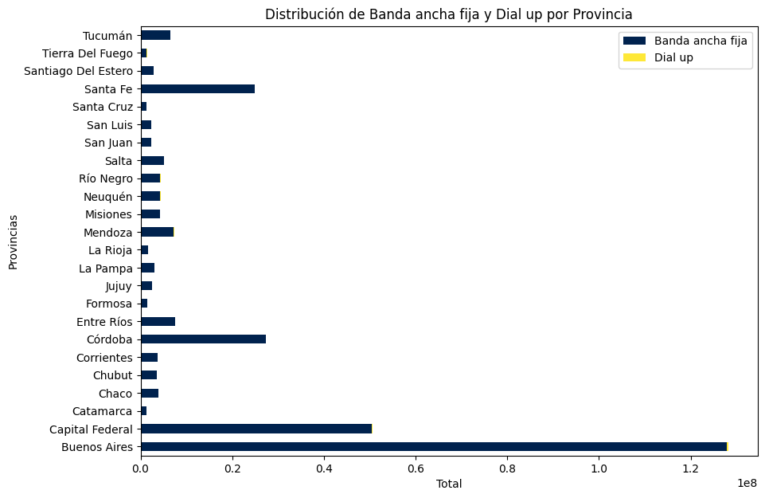
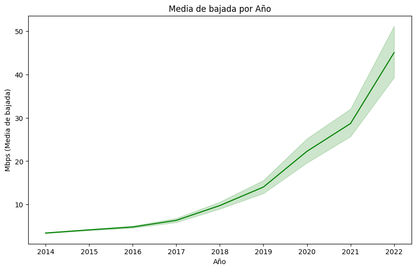

# <h1 align=center> **PROYECTO INDIVIDUAL Nº2** </h1>

# <h1 align=center>**Data Analytics**</h1>

  

# <h1 align=center> **Introducción** </h1>

En la era moderna, las telecomunicaciones desempeñan un papel esencial al permitir la transmisión de información a través de diversos medios electrónicos, que van desde la tradicional telefonía y la radiodifusión hasta la televisión y, más recientemente, el internet. Estos canales de comunicación han revolucionado la forma en que las personas, organizaciones y dispositivos se conectan, superando las barreras geográficas y permitiendo intercambios de información a larga distancia.

El internet, en particular, ha emergido como una red global de computadoras interconectadas, que ha transformado significativamente la vida cotidiana. Desde su creación, el internet ha tenido un impacto profundo en la sociedad, redefiniendo la manera en que nos comunicamos, trabajamos, aprendemos y nos entretenemos. Esta red global proporciona un medio para el intercambio de información en tiempo real y ha catalizado la evolución de una amplia gama de servicios y tecnologías que moldean nuestro mundo actual.

La industria de las telecomunicaciones desempeña un papel vital en nuestra sociedad al facilitar la comunicación e intercambio de datos a escala internacional. En particular, la pandemia mundial que experimentamos en la actualidad ha subrayado la importancia crítica de la continuidad de la comunicación, con las telecomunicaciones como un pilar fundamental para mantenernos conectados en tiempos de crisis.

En este contexto, el análisis de datos aplicado a las telecomunicaciones, y específicamente al ámbito del internet, se presenta como una disciplina clave para comprender y mejorar la eficiencia, calidad y seguridad de estos servicios. Este README se centra en explorar cómo los datos y análisis pueden desempeñar un papel crucial en este campo y destaca el caso de Argentina, que se encuentra a la vanguardia en el desarrollo de las telecomunicaciones con un total de `62.12` millones de conexiones para el año 2020. A lo largo de este documento, exploraremos cómo los datos y el análisis se aplican en el contexto de las telecomunicaciones, especialmente en el entorno de internet.

# <h1 align=center> **Descripción** </h1>

En el repositorio actual, se encuentra disponible el archivo [inspeccion.ipynb](/inspeccion.ipynb), el cual contiene toda la información recopilada de la página oficial de [`ENACOM`](https://datosabiertos.enacom.gob.ar/dashboards/20000/acceso-a-internet/) (Ente Nacional de Comunicaciones). En este archivo, realizamos una breve exploración de cada conjunto de datos descargado en formato Excel. Nuestro objetivo principal es obtener una comprensión de los datos, identificar posibles valores atípicos, duplicados o valores nulos, y así prepararnos para llevar a cabo un análisis más detallado en un segundo archivo denominado [Eda_p1](/Eda_p1.ipynb).

Esta fase inicial de inspección y limpieza de datos es esencial para garantizar la calidad y confiabilidad de nuestras observaciones antes de embarcarnos en análisis más complejos y tratamientos de datos. Nuestra intención es proporcionar una base sólida y confiable para futuros análisis y conclusiones basadas en la información recopilada de la página ENACOM.

En la segunda fase, nos adentraremos en el archivo [Eda_p1](/Eda_p1.ipynb) donde retomaremos la inspección de los conjuntos de datos que previamente fueron revisados en el archivo anterior. Abordaremos cada dataset de manera individual, utilizando la biblioteca de pandas para cargar archivos Excel y visualizarlos como dataframes. Este proceso se enfocará principalmente en la identificación y corrección de valores incorrectos.

Nuestra estrategia se basa en la detección y tratamiento de valores nulos, que, en este caso, son escasos y suelen llenarse con ceros siguiendo un criterio específico. Además, nos ocuparemos de abordar valores atípicos, la identificación de duplicados, la corrección de errores tipográficos y la conversión de tipos de datos, como de cadenas de texto a números enteros y viceversa.

Una vez que hayamos abordado estas cuestiones en cada dataset, avanzaremos en la creación de visualizaciones gráficas. Para ello, haremos uso de las bibliotecas matplotlib y seaborn, generando gráficos como boxplots, gráficos de líneas para observar tendencias a lo largo del tiempo y gráficos de barras, todo con el objetivo de proporcionar una representación más clara y efectiva de los datos analizados.

# <h1 align=center> **Observaciones** </h1>

La tecnologia a lo largo de estos ultimos años ha tenido un desarrollo importante, tal es el que caso en el área de las redes o las telecomunicaciones. Prácticament la mayor parte de las provincias de Argentina usan Banda ancha ya que ofrece una experiencia de Internet más rápida, estable y versátil en comparación con la conexión dial-up, lo que la convierte en una opción superior para la mayoría de las necesidades de los usuarios en la actualidad.

  

- El mayor número de usuarios se encuentra en Buenos Aires, seguido de Capital Federal y después tenemos a Córdoba y Santa Fe un poco reñidos. Podemos observar lo dominante que es Banda Ancha en todos los casos.

Ahora bien, del gráfico anterior, lo seccionamos para observar para cada provincia, que tipo de conexión predomina:
|  | |
| --------- | --------- |
|  |  |

- Cable modem, Adsl y Fibra óptica son las que normalmente dominan, sin embargo vemos que Adsl va en picada hacia abajo conforme pasa el tiempo, mientras que Fibra óptica va ganando terreno por sus carácterísticas de velocidad, fiabilidad y capacidad de ancho de banda lo que hace que vaya en subida y más clientes estén optando por escoger este tipo. Podemos ver que Cable modem sigue siendo lider, pero no sabemos por cuánto tiempo...
Sin embargo, la elección entre Cable módem y Fibra óptica dependerá de la ubicación, las necesidades individuales y las ofertas de los proveedores de internet en cada área. La competencia entre estas tecnologías ha impulsado mejoras en ambas, lo que beneficia a los consumidores con una mayor variedad de opciones de conectividad.

Podemos observar un punto importante en el gráfico a partir del año 2019 en fibra óptica y cable módem que son los más utlilizados y seguramente afectó de manera positiva en estos casos. La velocidad media de descarga de Internet ha aumentado en los últimos años debido a avances tecnológicos y mayores inversiones en infraestructura de red. Los proveedores de servicios de Internet han desplegado conexiones de fibra óptica y mejorado las redes de cable lo que satisface la creciente demanda de aplicaciones en línea, como streaming, juegos y trabajo remoto. Esto ha llevado a un aumento constante en la velocidad promedio de descarga en todo el mundo. Lo que también logramos ver es que a partir del 2019 tuvo un incremento considerable, un punto importante acá es que en dicho año comenzó pandemia, lo que afectó de manera postitiva que los servicios de internet comenzaron a mejorar sus servicios y la tecnología implementada debido a la alta demanda de internet gracias al confinamiento:

  

- Ahora bien, a medida que pasa el tiempo, un número creciente de personas ha obtenido acceso a Internet, y es probable que esta tendencia continúe en el futuro. La creciente penetración de Internet puede atribuirse a varios factores, incluyendo el desarrollo de la infraestructura de telecomunicaciones, las políticas gubernamentales favorables y la creciente demanda de los consumidores por los servicios de Internet. La creciente demanda de servicios de Internet durante la pandemia puede haber impulsado inversiones adicionales en infraestructura de Internet, lo que a su vez puede haber contribuido al aumento en la penetración de Internet. Algunos ejemplos notables que contribuyeron a esto incluyen el trabajo remoto en muchas empresas, así como el crecimiento de la comunidad de streamers que transmiten en vivo. Estos son ejemplos de cómo la tecnología ha cambiado la forma en que trabajamos y nos conectamos:

  

# <h1 align=center> **KPI'S** </h1>

En esta sección, abordaremos los KPIs (Indicadores Clave de Desempeño) que hemos desarrollado en Power BI para evaluar y rastrear aspectos críticos relacionados con el acceso a Internet. Estos KPIs proporcionan información valiosa sobre el aumento del acceso a Internet y la calidad de la conexión en nuestra área o proyecto. La implementación del panel de control se realizó con Power BI, una herramienta de visualización de datos. Power BI nos permite crear gráficos, conectar múltiples fuentes de datos en este caso archivos excel, ofrecer una experiencia interactiva, actualizar en tiempo real y promover la colaboración. Esta elección nos brinda la capacidad de tomar decisiones informadas y evaluar el impacto de nuestras acciones de manera efectiva. A continuación, presentamos los KPIs principales que hemos creado:

1. **KPI: Aumento del 2% en el acceso a Internet**

2. **KPI: Objetivo de 40% en la velocidad de Internet por año**

Para el primer KPI, el objetivo es aumentar en un 2% el acceso al servicio de internet para el próximo trimestre, cada 100 hogares, por provincia.

### Ejemplo de uso

  

- En la imagen anterior, tenemos un ejemplo de nuestro dashboard de Power Bi. La imagen muestra un KPI (Indicador Clave de Rendimiento) que indica un aumento del 2.22% en el acceso a Internet en la provincia de Buenos Aires durante el 3er trimestre del año 2019. Este valor supera el objetivo establecido del 2.00% en un 11.22%. Esto sugiere que el acceso a Internet en esa provincia ha experimentado un crecimiento positivo, superando las expectativas. El objetivo de este KPI es medir el aumento en el acceso al servicio de internet para el próximo trimestre, cada 100 hogares, por provincia. Este indicador puede ayudar a la empresa a evaluar su desempeño en el mercado de las telecomunicaciones, identificar las provincias con mayor o menor demanda de internet, y diseñar estrategias para mejorar la calidad y cobertura de su servicio.

### Ejemplo de uso

  

- Para el segundo Kpi tenemos el objetivo de aumentar en un 40% la velocidad de media de bajada por año. El KPI generado es una herramienta valiosa que logra ser utilizada para rastrear y mejorar la velocidad media de descarga en un 40% anualmente, lo cual es crucial en el sector de las telecomunicaciones. Logramos ver en el ejemplo que filtramos con la provincia de Córdoba para el año 2019, comparado con el año anterior logramos obtener un 45.76%, un 5.76% mas del objetivo. Al alcanzar y superar dicho objetivo, la empresa que lo requiera puede ser capaz de manejar más volumen de datos, mejorar su rendimiento y ofrecer un mejor servicio a los clientes. En resumen, este KPI muestra que la empresa está en camino de mejorar la eficiencia y la satisfacción del cliente en términos de velocidad de descarga de internet.

### Conlusiones
Hemos explorado cómo las telecomunicaciones en el ámbito de Internet han experimentado una revolución a lo largo de los años. Examinamos datos relacionados con el acceso a Internet en Argentina, destacando su evolución y las preferencias tecnológicas de los usuarios. Observamos cómo la velocidad de conexión ha mejorado con el tiempo, especialmente durante la pandemia, lo que ha llevado a un aumento en la demanda de servicios de Internet. Además, hemos presentado KPIs esenciales para evaluar el desempeño de las telecomunicaciones, como el aumento en el acceso a Internet y la mejora en la velocidad de descarga. Estos indicadores proporcionan una visión clara de cómo las telecomunicaciones están evolucionando en Argentina y cómo las empresas pueden seguir mejorando sus servicios.

En resumen, este trabajo ha analizado de manera exhaustiva la situación de las telecomunicaciones en Argentina, resaltando su importancia en la sociedad actual y destacando cómo los datos y el análisis desempeñan un papel fundamental en la toma de decisiones y la mejora de los servicios de Internet en el país.

## Archivos del Repositorio
- [inspeccion.ipynb](/inspeccion.ipynb)
- [Eda_p1.ipynb](/Eda_p1.ipynb)
- [Datasets limpios una vez realizado el Eda](/data_limpia_excel/)
- [Imágenes](/imgs/)

## Fuentes de datos
El repositorio no contiene los datos originales, a continuación dejo el link de los archivos trabajados de la página ENACOM:

- [Datasets ENACOM](https://datosabiertos.enacom.gob.ar/dashboards/20000/acceso-a-internet/)

## Autor
- Laurence Salas Luis Alberto
- Email: llaurencesalas@gmail.com
- [GitHub](https://github.com/LuisLaurence23)
- [LinkedIn](https://www.linkedin.com/in/luis-alberto-laurence-salas-036a32187/)